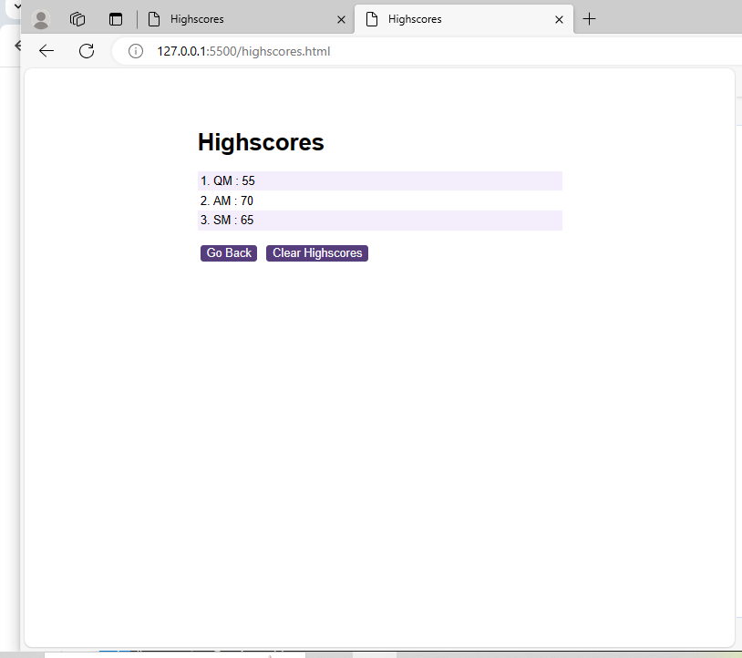
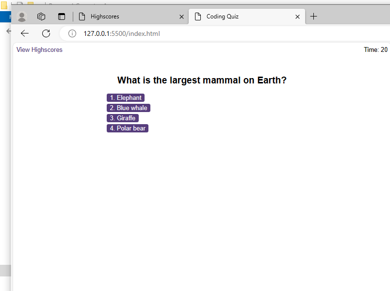

# Quiz-App

Timed coding quiz with multiple choice questions

Description :

A Quiz has been made with the following functions:

- When A start quiz button is clicked a timer starts and the first question appears.

- Questions contains four option buttons for each answer.
- When answer is clicked, the next question appears.
- When the answer clicked is incorrect then the time is subtracted from the clock.
- The quiz ends when all questions are answered or the timer reaches 0.
- When the quiz ends, it should display the score.
- Also the user can save their initials and score at the end of the quiz.

The screenshot of working quiz(Highscore record page and app page)

URL of the deployed application

[https://almasmansuri.github.io/Quiz-App/](https://almasmansuri.github.io/Quiz-App/)https://almasmansuri.github.io/Quiz-App/
